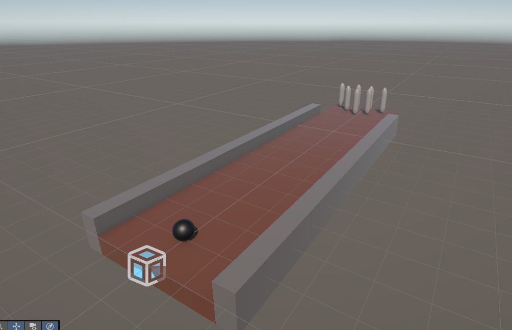

# My first VampireSurvivor-like in Bevy

## 0. Before the course

[Install Unity Hub](https://unity.com/download)

Once Unity Hub is installed, make sure to install the latest version of Unity.

You can make sure everything is working fine by creating a new default 3d project.

**Feel free to ask for help for any questions you might have before and during the project**

## 1. Basics

This course assumes you already know the basics of Unity, including creating objects, manipulating components and rudimentary scripting.

## 2. The project

To learn about 3d games, I chose the Wii Sports bowling mini game as a reference.
It should serve as a good starting point to learn 3d games, leaving plenty of space for creativity later on.

Feel free to choose another game to make if you feel like it.

## 3. Setting up the alley

### 3.1 The Alley
If we want to play bowling, we will need a bowling alley.

You can right-click in the `Hierarchy` to access the `3d Object` spawn menu to spawn the necessary cubes.
You can then translate, rotate and scale them into the alley of your dreams.
They will automatically get colliders, which will be useful whenever we do physics.

### 3.2 The pins

You can then use the same method to make one bowling pin out of a capsule or cylinder.

Since we will want many identical copies of this object, we can make a prefab out of it, which will make our lives easier.

To do so, simply drag the pin object from the `Hierarchy` to your `Assets`, this should create a new asset that you can then drag into the scene whenever you need more pins.

If you want to edit the pin, you can simply double click the prefab asset to edit the original, applying the modifications on the copies.

### 3.3 The ball

Using the same method as before, you can simply spawn a sphere, make sure to size it correctly relative to your alley

### 3.4 Materials

If you want to add color to your scene, you can create a new material by right clicking the `Assets`  window then `Create->Material`.

This will create a new material in your assets that you can change the color of and apply to objects by dragging the material onto them.

You should now be left with something that looks like this, feel free to add your own touch if you desire, be it more decor or aditional details.



Don't forget to position your `Main Camera` so that it is looking at the alley

## 4. Physics

Right now if you start the scene, nothing will happen. That is because every object is static by default.

To make an object be affected by gravity and it's environment, simply add the `Rigidbody3D` component.

It it called rigidbody because it treats every object as incompressible, which is a close enough approximation for our bowling purposes.

## 5. BOWLING

Now we finally get to code our bowling game.

I will assume you know some basics of C# coding, but I am nice enough to give you a small script as a starting point:

```C#
using UnityEngine; //Use unity's bindings

public class BowlingBall : MonoBehaviour //Declare a C# class for a bowling ball
{
    private Rigidbody rigidbody; //Declare rigidbody variable

    void Start() //Runs at the start
    {
        rigidbody = GetComponent<Rigidbody>(); //Set our rigidbody variable to the one on the ball
    }

    void Update() //Runs every frame
    {
        if (Input.GetKeyDown(KeyCode.Space)) //If we pressed space this frame
        {
            rigidbody.AddForce(transform.forward * 1000, ForceMode.Force); //Then we apply a large force to the ball along it's forward axis
        }
    }
}
```

If you add a new script component to the Bowling ball and paste this code, you should now be able to play bowling by pressing space one you start the game (a very boring bowling).

With this new found power you can now expand the idea any way you want.

If you don't feel very inspired, here's a list of ideas you can implement, otherwise feel free to do whatever you want next.

**Feel free to ask for help for any questions you might have.**

Level 1:
- Make the ball move left and right (automatically or manually)
- Control the speed of the ball (I recommend looking up [GetKey](https://docs.unity3d.com/6000.0/Documentation/ScriptReference/Input.GetKey.html) and [GetKeyUp](https://docs.unity3d.com/6000.0/Documentation/ScriptReference/Input.GetKeyUp.html))
- Control the direction of the ball
- Add obstacles to the alley (static or dynamic)

Level 2:
- Add a button to reset the bowling ball
- Add a button to reset the pins
- Add a score system
- Add control of the rails
- Add visualisation of some kind (score, power, direction or whatever)

Level 3:
- Add a highscore system with ranking
- Add ball spin as a mechanic
- Make cool camera moves
- Add different ball types you can select
- Make a dynamic decor

As a game developper, your imagination is now the limit.

